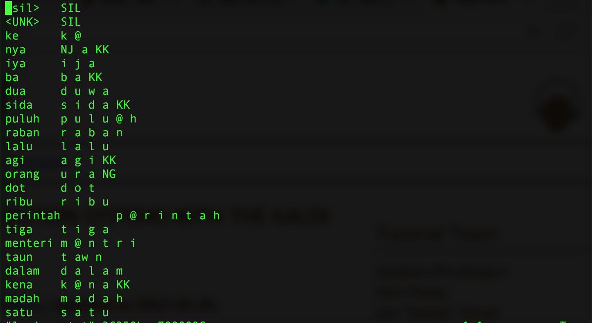
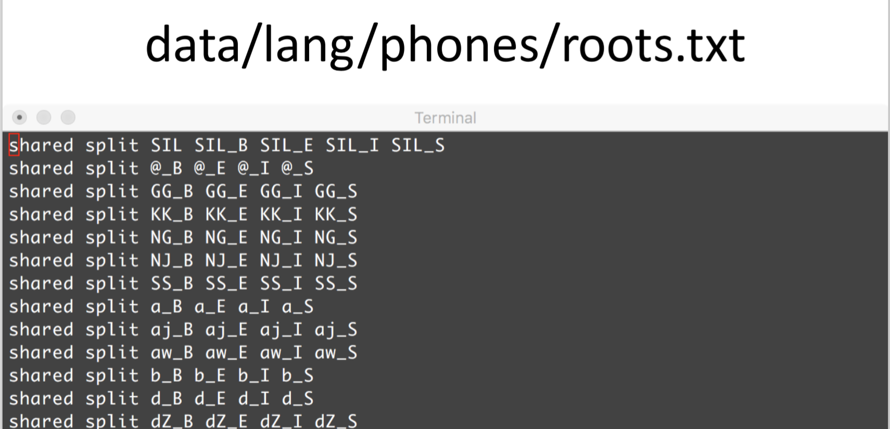

# Preparing the Pronunciation Lexicon

These are created by "prepare-dict" script, and will be stored in `/kaldi/egs/iban/s5/data/local/dicts`.

In lexicon.txt:

<UNK> is something unknown, which is replaced by SIL for silence, pronounced. Silence is pretty much used for anything that's not a word.

Also creates nonsilent_phones.txt. It's a list of all nonsilent phones. It also creates silence_phones.txt, by default containing SIL. 

For example, there are different pauses, like after someone utters something and then continues onto another word, these could also be put in optional silences. Optional silent phones is for context independent phonemes, and in aprticular, in silence_phones.txt, in particular, a context-free no-phones or words being uttered.

Now, there's a file called `ov.txt`. Sometimes, a special phoneme is used thatwe don't want to associate SIL. It's created by the prepare-dict script.

---

This directory has a lexiconp.txt, but this is preprocessed. Now go to the lang, `/data/local/lang/` directory, which will be processed, and it will also have a lexiconp.txt.

Now, there is a lexiconp.txt. Sometimes words have different pronunciations, and you'd like to take advantage of this. These probabilities can be built into the dictionary. Initially, they start out at 1.0 in lexiconp.txt, which will get rescaled after normalization. For example, "the" can be pronounced "thuh" or "thee". So, during the decoding, Kaldi can take advantages of the lexicon.txt or lexiconp.txt.

For example, the "p" in captain is different than the "p" in picture. We'd like to build different models. Left and right phonemes should be obvious within a single word. With word boundaries, it's a little more subtle. So they'll build entirely different phonemes, where a_B or a_E are two different phonemes. A separate file will associated.

There's also a lexicon_disambig.txt. 

Sometimes two words have the same pronunciation, for example "red" and "read". You may have the correct phoneme, but the definition words, and computation is difficult. Kaldi uses finite state machines (FSM), and attempting to parse through the FSM, this will be problematic. To remedy, just call them two different pronunciations. It will put different pronunciation symbols in front of them. There will be hashtags with a number after it before and after the phonemes. The number of that will be the maximum number of words with the same sound...this number is typically small. 

## Phone and word mapping

These are stored in `data/lang/(phones|words).txt`, in sorted order.

## Topology

Each is typically a HMM. It's a description of an HMM. All the phones are using the topology, and the file is called "topo". 

Most of the time you don't need to monkey with this file.

## Roots

Groups of phonemes. The phone aj_B aj_E aj_I aj_S should be grouped together, because they're the same phoneme, only. The reason why, context dependendent and these are done with a decision tree. There's a process afterward for decoding. All these belong to the same root of a tree.

## Extra questions

For the model for the `p`. Is it better to have word initial and word final `p`. More specialized? Are they significantly better to have two rather than single? Kaldi will decide whether or not they can separate the two.

This will be grouped it. If you look at it, then everything in the first will have a phoneme B. Then, you may want to do something different depending on whether or not it's in the same set.

You can put things in some set depending on what you'd like to ask.

The reason they're called extra questions, is because in the old days they'd think about the context of a phoneme. So, if there are phonetic and linguistic knowledge of what's to the left or to the right of a phoneme. The phonemes are typically modeled via clustering, and were organized into similarity, and then any cut through the tree creates group of phonemes. This is nice since it's entirely data driven. The questions built automatically from the cuts through the trees generated by clustering are the *original* questions. These are the *extra* ones. These may not be linguistic motivated, but they answer similar question.
