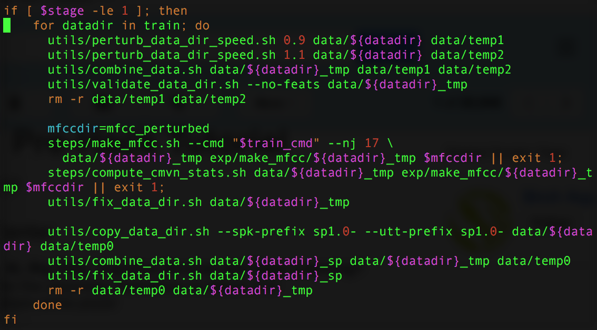
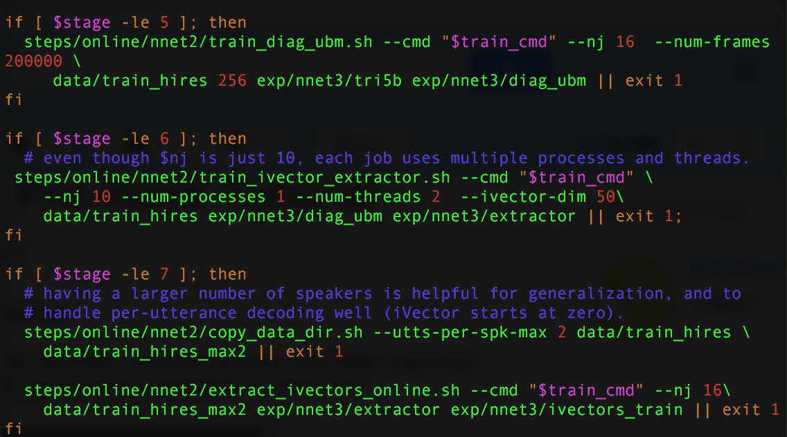
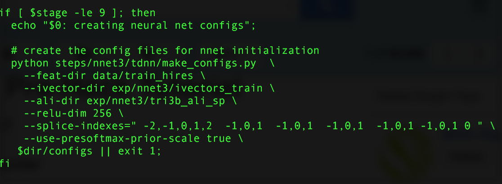

# Neural Network Models

In `local/nnet3/run_ivector_common.sh`, the neural network model can be found. If you feed in MFCC vectors in neural network and the HMM state label, and tries to predict it, in order to adapt to different acoustic channels, we compute something called an ivector, aggregated over the whole sequence. In addition to the MFCCs in the speech, it is appended to get the gains in the neural network that we'd originally get in the GMM.

The other idea is data augmentation to make sure that it is robust. The neural networks can get robust artificially, and you can get things like room reverb and stuff like that to get new copies of the data that are somehow more noisy. These additional copies didn't really help in the GMM case, but in NN they helped a lot. In Google, they started with 7k hours, and then increased it 10x. The perturbation and noise and variability that are artificially used helped the performance.

The third challenge as part of the Aspire Challenge, the higher order cepstral coefficients, the NN learned those relationship. Having more cepstral coefficients continue to help. 

Once the i-vector extractors, you can extract it with `extract_ivectors_online.sh`. There's one part for the training data and one for the dev data.

After these are all finished, then there's this the makeconfigs.py. The neural network topology is created by `make_config.py`, which has a bunch of imports of where ivectors come from, where the trigrams are, and so on. You can also specify the nonlinearities, in this case rectified linear units.

The configuration gets put into `/exp/nnet3/tdnn_1/configs`.

And then, in `steps/nnet3/train_dnn.py`, we train, where you can specify epochs, learning rate, samples per batch, etc.

