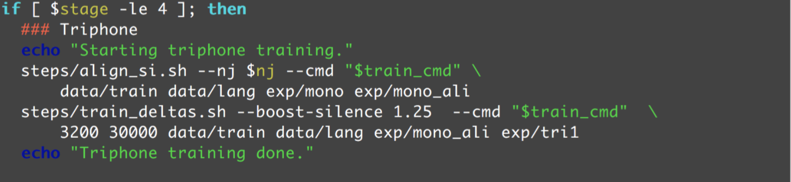
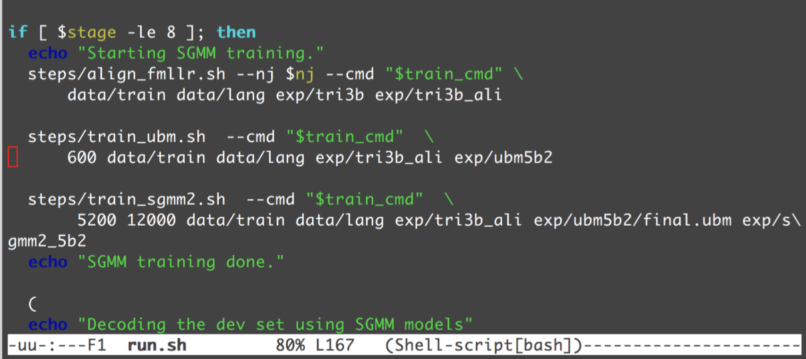

# GMM Training in Kaldi

In `run.sh`, you'll come across these lines:

In training the deltas. The first argument is the number of leaves and the number of Gaussians is the second number. Typically the ratio will be about 10-15. Anymore and it's a lot of expressive power for a given leaf.

Delving deeper into `train_mono.sh`, you'll find several options and knobs. Once trained, you'd like to align them up. For every 10ms second, you'd like to label. In the beginning, you don't have it, so you train mono from scratch. Before doing this, you'll do align. You build the model, then you align, and then you bootstrap to train the next more complex model. That's a fairly common tendency. Realign everything. For example, after 10 iterations, try to realign again.

One parameter of importance is `beam`, currently set to 10. This will speed up training a fair bit. However, if the training data is noisy, very often what will happen `beam` will prune everything out. The fallback beam is `retry_beam`. The parameter relates to [*beam search*](https://en.wikipedia.org/wiki/Beam_search) in computer science.

Also, an interesting point: stage=-4. This will set the initial script to start at if you don't want to start all over.

There are a whole bunch of random training transformations, based on whatever triphone and monophones.

The Universal GMM and individual SGMMs:

Before building the GMM, we'd like to understand the entire acoustic space. You first build a universal GMM for all the speech, with for example 6000 Gaussians. Then, you look at each individual sample, and build the GMM. This is called the UBM. Then, you use the UBM as the underlying subspace to seed the SGMM, which will improve performance.
