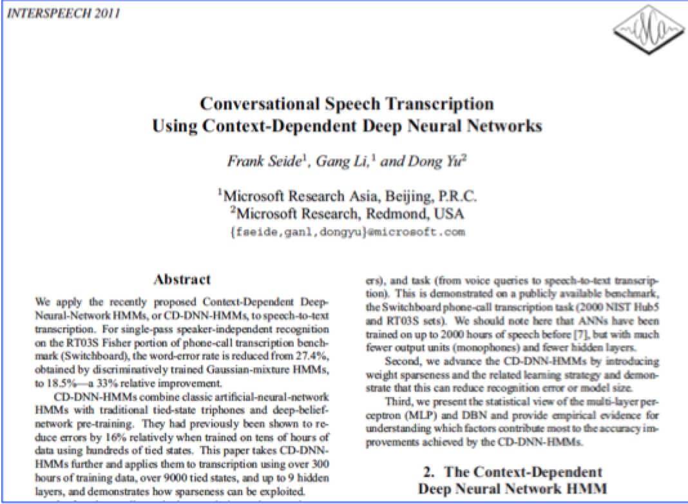
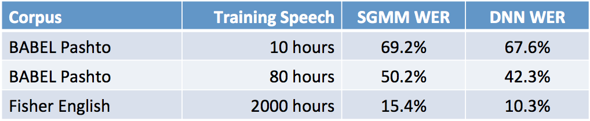
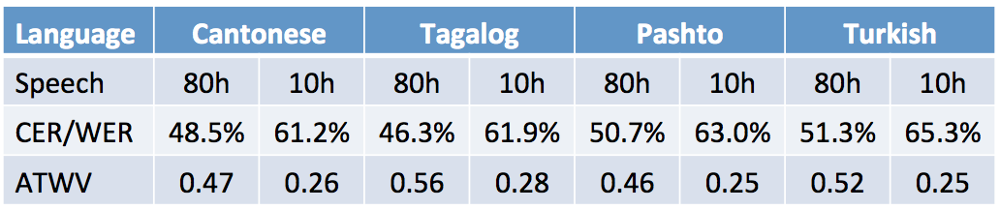

Deep neural networks for STT, 38% better. Interspeech 2011. After this paper, Dan Povey took notice, and began. This particular corpus is still being used by all the large corporations. At this point WER is better than human, though probably some overfitting.

Kaldi recipes provide a robust starting point, these numbers actually being better than Microsoft's on different languages:

In 1998 in the NIST TREC SDR, 
In 2006 in the NIST STD Pilot, STT
Limited language diversity in available.
Finally, in 2012, IARPA Babel, Kaldi provided helped lots of the community. 

The typical Babel full LP condition. In various,

Another thing that Kaldi buys is that it is parallel GPU-based training, supposedly simple, though toolboxes like Tensorflow are now in this space. Several solutions is, delayed SGD, lock-free SGD, gradient averaging, and modeling averaging in 2014. Typically, a single GPU is 10x faster than a 16 core CPU, linear improvement until 4 GPUs, then diminishing returns on more GPUs. This becomes apparent in the IARPA ASpIRE Challenge.

The ASpIRE, is ASR in reverberant environments, acoustic environments and recording scenarios. Test WER is 44.3%, large combinations of stuff.

TDNN or LSTM-RNN models on our data. Could not get CTC models to work. Dialed up friends at Microsoft. If you really want to see any improvement, see if you get 1000's of hours of speech.

