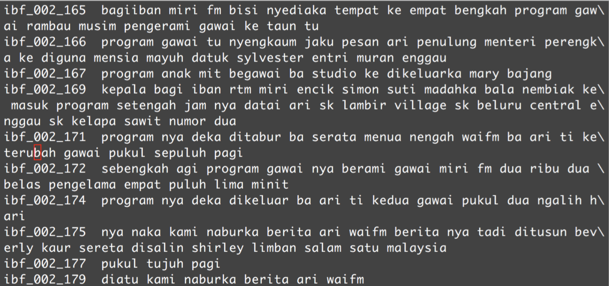
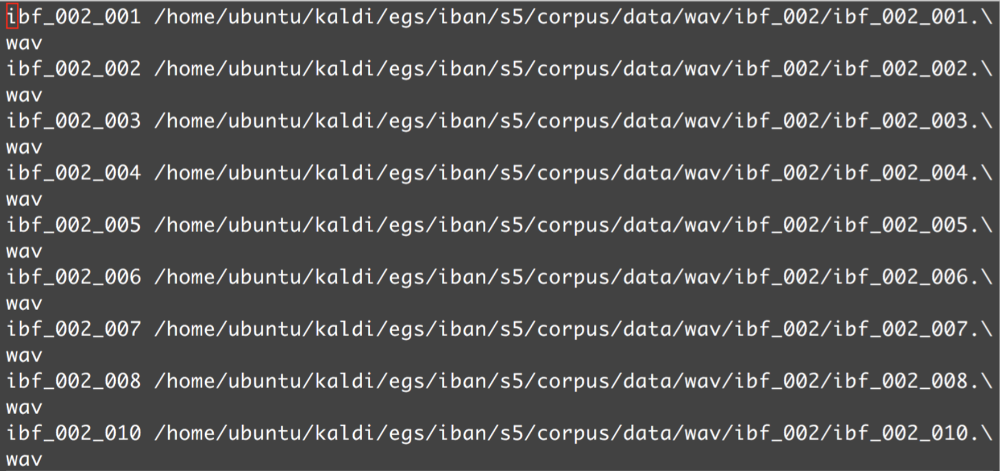
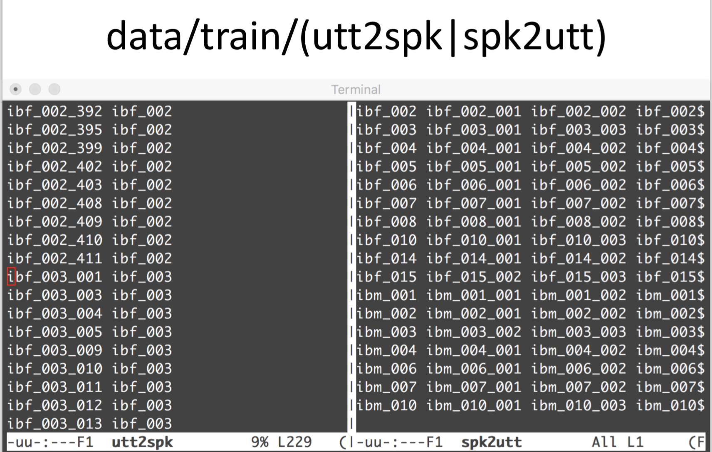

These are coded in UTF-8, and they are case sensitive:

corpus-speaker-utterance transcript

UTF-8 has an unfortunate property where there's freedom in the UTF-8 will write it different. Then, string-matching will match when flip. Two-entries in dictionaries with flipped may look the same.

The wave files stored in scp file: 

The *.scp is short for script, because Dan Povey was educated in Cambrdige and not necessarily a shell script, but literally a script of things to do. The filename is order of. Doesn't need to be just a *.wav file, but it could be a command name and then filename. For example, sometimes there are codec issues. If the command can go to standard out, then Kaldi will execute it.

Prepare script. Utterance to speaker. Speaker to utterance. Typically, channel remains consistent. Channel normalization. Don't want to do on one utterance of a time. There's enough speech to do equalization. Phone call to phone call are not consistent, though. Spk2utt, the same thing only reverse.
