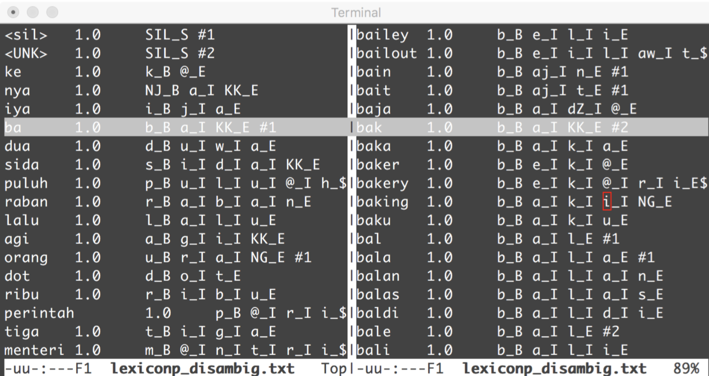

# Preparing the Pronunciation Lexicon

These are created by "prepare-dict" script, and will be stored in `/kaldi/egs/iban/s5/data/local/dicts`.

In lexicon.txt:

<UNK> is something unknown, which is replaced by SIL for silence, pronounced. Silence is pretty much used for anything that's not a word.

Also creates nonsilent_phones.txt. It's a list of all nonsilent phones. It also creates silence_phones.txt, by default containing SIL. 

For example, there are different pauses, like after someone utters something and then continues onto another word, these could also be put in optional silences. Optional silent phones is for context independent phonemes, and in aprticular, in silence_phones.txt, in particular, a context-free no-phones or words being uttered.

Now, there's a file called `ov.txt`. Sometimes, a special phoneme is used thatwe don't want to associate SIL. It's created by the prepare-dict script.

---

Now, there is a lexiconp.txt. Sometimes words have different pronunciations, and you'd like to take advantage of this. These probabilities can be built into the dictionary. Initially, they start out at 1.0 in lexiconp.txt, which will get rescaled after normalization. For example, "the" can be pronounced "thuh" or "thee". So, during the decoding, Kaldi can take advantages of the lexicon.txt or lexiconp.txt.

For example, the "p" in captain is different than the "p" in picture. We'd like to build different models. Left and right phonemes should be obvious within a single word. With word boundaries, it's a little more subtle. So they'll build entirely different phonemes, where a_B or a_E are two different phonemes. A separate file will associated.

There's also a lexicon_disambig.txt. 

Sometimes two words have the same pronunciation, for example "red" and "read". You may have the correct phoneme, but the definition words, and computation is difficult. Kaldi uses finite state machines (FSM), and attempting to parse through the FSM, this will be problematic. To remedy, just call them two different pronunciations. It will put different pronunciation symbols in front of them. There will be hashtags with a number after it before and after the phonemes. The number of that will be the maximum number of words with the same sound...this number is typically small. 

## Phone and word mapping

These are stored in `data/lang/(phones|words).txt`, in sorted order.

## Topology

Each is typically a HMM. It's a description of an HMM. All the phones are using the topology, and the file is called "topo". 

Most of the time you don't need to monkey with this file.

## Roots

Groups of phonemes. The phone aj_B aj_E aj_I aj_S should be grouped together, because they're the same phoneme, only. The reason why, context dependendent and these are done with a decision tree. There's a process afterward for decoding. All these belong to the same root of a tree.

